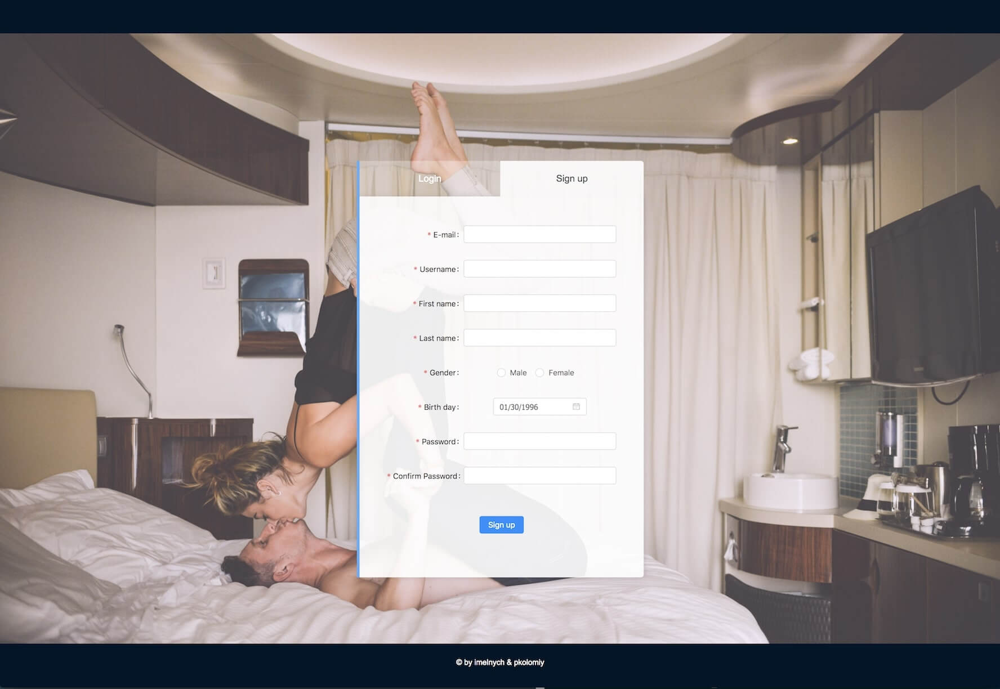
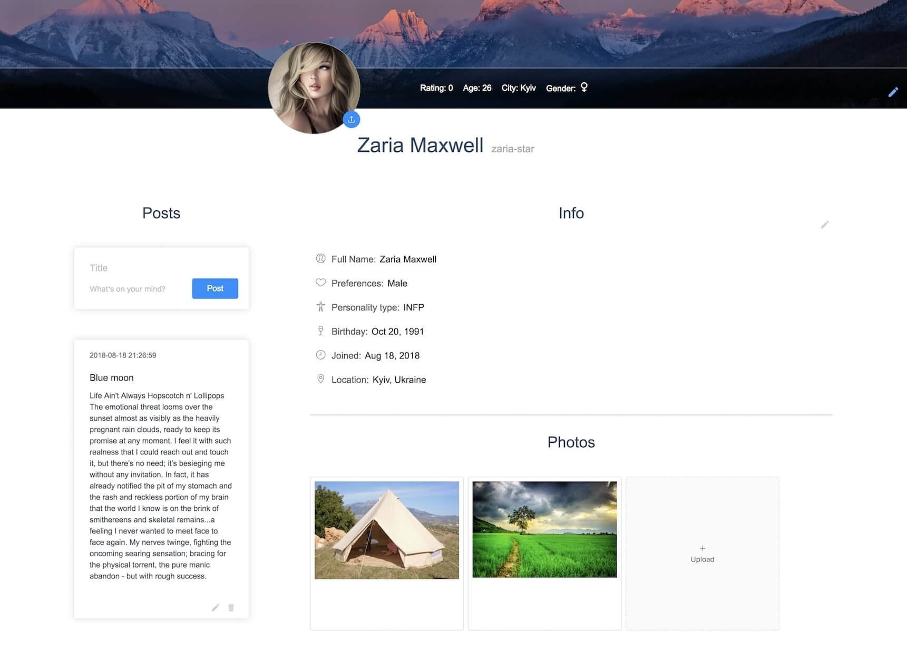
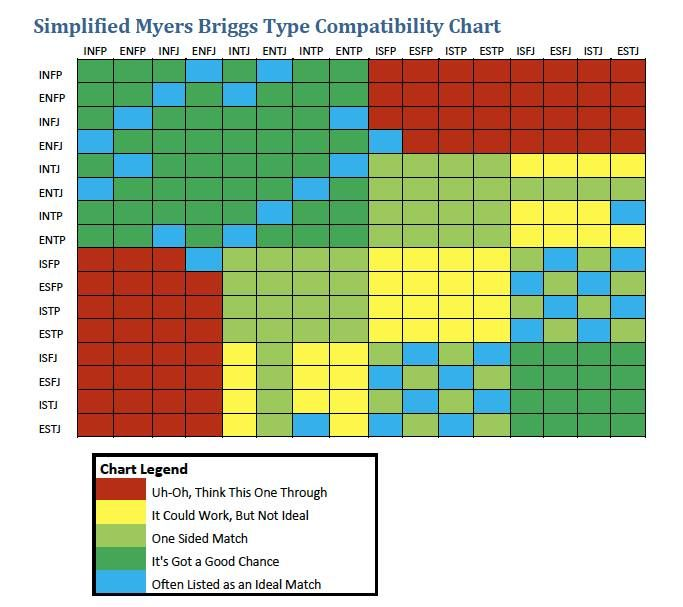

# Matcha

## Project overview

Project of school 42: web site allowing a user to register, fill his/her profile with
photos, gender preferences, interests, set the location (country and city), or it will be
updated automatically if the user allow to track his/her geo location.
The user is able to search and look into the profile of other users, like them and chat with those that “liked” back.
On the 'match' page, the user will see only the users that are considered to be the perfect match
for him/her based on preferences, 'fame' rating, interests and a type of personality
(according to Myers Briggs test).

## Mandatory part
### Registration and Signing-in
The app must allow a user to register asking at least an email address, a username, a last
name, a first name and a password that is somehow protected. After the registration, an
e-mail with an unique link must be sent to the registered user to verify his account.
The user must then be able to connect with his/her username and password. He/She
must be able to receive an email allowing him/her to re-initialize his/her password should
the first one be forgotten and disconnect with 1 click from any pages on the site.

### User profile
Once connected, a user must fill his or her profile, adding/changing the following information:
* Sexual preferences (by default the preference set to 'both')
* Biography
* List of interests with tags (ex: #vegan, #geek, #piercing etc...). These tags must be reusable
* Pictures, max 5, including 1 as profile picture

At any time, the user is be able to modify these information, as well as the last
name, first name and email address.
* The user is be able to check who looked at his/her profile as well as who “liked”
him/her in notification section.
* The user havs a public “fame rating”.
* The user is located using GPS positionning, up to his/her neighborhood.
* If the user does not want to be positionned, he/she is located by IP address (however, it's location is 
not as precise as the allowed method).
* The user is be able to modify his/her GPS position in his/her profile.
* User may post up to 5 entries about whatever she/he wants.

   
### Browsing
The user must be able to easily get a list of suggestions that match his/her profile.

**The app cleverly match profiles by:**
* Same geographic area as the user
* Common tags
* Maximum “fame rating”
* People from the same geographical area shown in priority
* Compatibility of personality type (if filled)

The user is be able to run an advanced research selecting one or a few criterias such
as:
* Age gap
* “fame rating” gap
* Distance
* One or multiple interests tags
As per the suggestion list, the resulting list must be sortable and filterable by age,
location, “fame rating” and tags

**The compatibility chart**

The list is filterable by age, localization, “fame rating” and common tags.

### Profile of other users
A user must be able to consult the profile of other users. Profiles must contain all the
information available about them, (except for the personal details, like email address).
When a user consults a profile, it must appear in his/her visit history.
The user is also able to:
* Like another user (only if the current user have an avatar, otherwise, he/she cannot complete this action
). When two people “like” each other, we will say that they are **“match”** and are now able to chat. 

* See the “fame rating”
* See if the user is online, and if not see the date and time of the last connection.
* Report the user as a “fake account”.
* Block the user. A blocked user won’t appear anymore in the research results and
won’t generate additional notifications.

A user can clearly see if the consulted profile is connected or “like” his/her profile and
must be able to “unlike” or be disconnected from that profile.

### Chat
When two users are connected, they must be able to “chat” in real time. The user must be able to see from any page if
a new message is received.

### Notifications
A user must be notified in real time6 of the following events:

* The user received a “like”
* The user’s profile has been checked
* The user received a message
* A “liked” user “liked” back
* A connected user “unliked” you

A user must be able to see, from any page that a notification hasn’t been read.
    
## Getting started

This app requires npm to build, if Node and npm are not installed on your device, you  [here](https://docs.npmjs.com/getting-started/installing-node)
1. Clone git repo
2. Go to server/database and run `sqlite3 matcha.db < setup.sql` to setup database
3. cd back to root of repository and run `npm install`.
4. After installation run `npm server`. This will open app in http://localhost:5000
